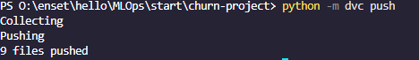
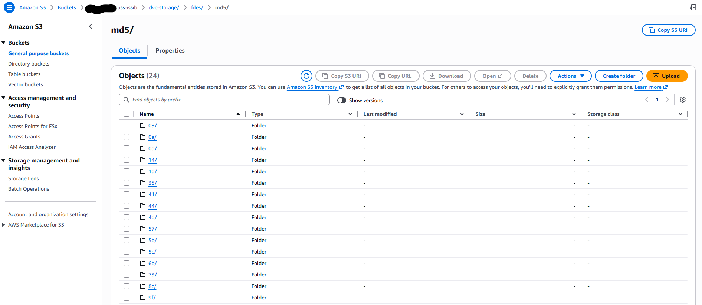
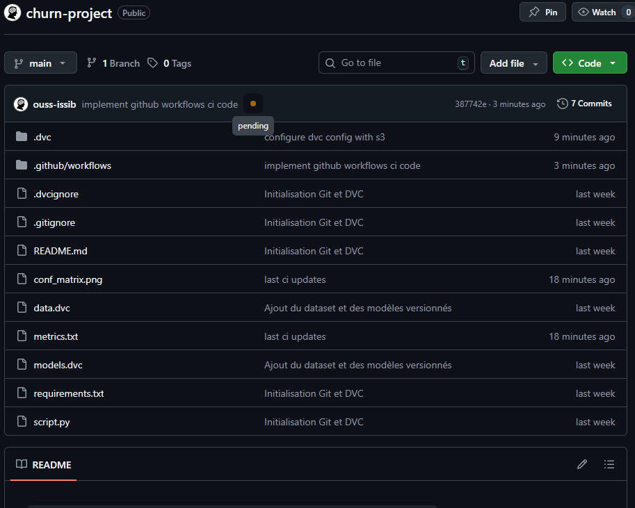
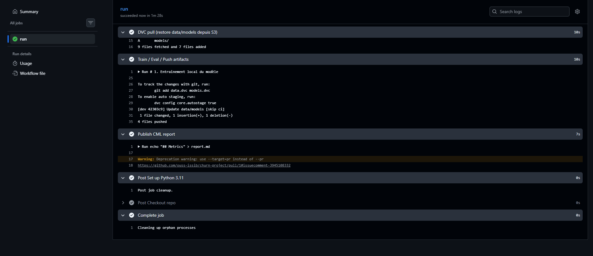
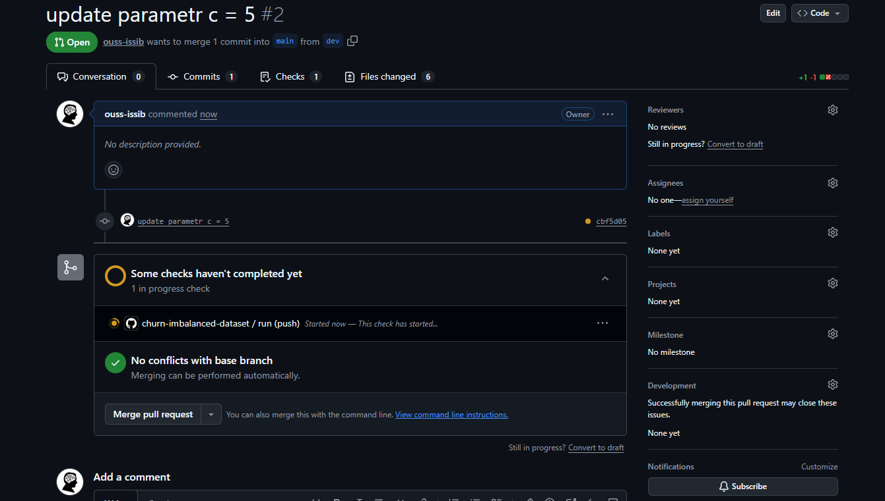
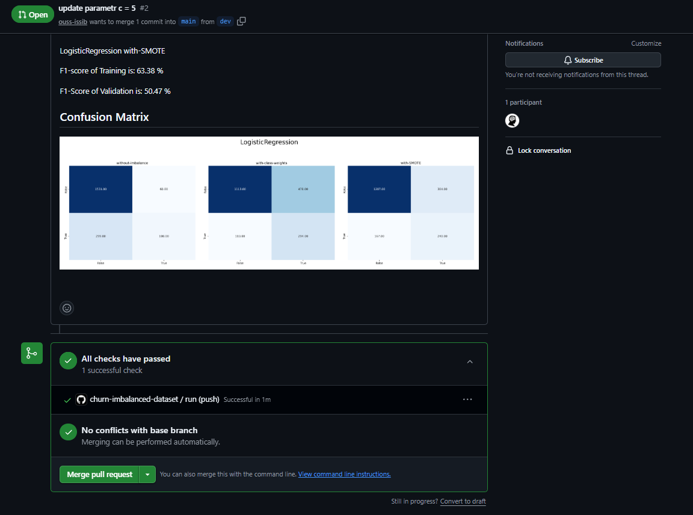
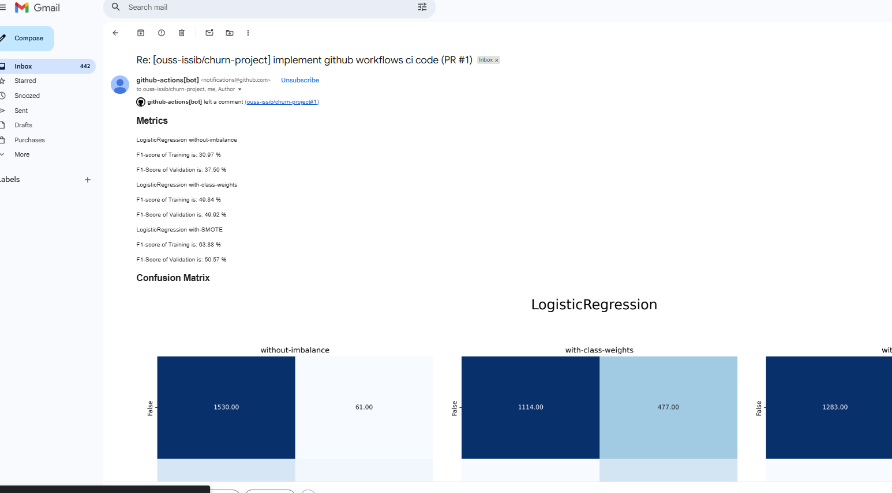
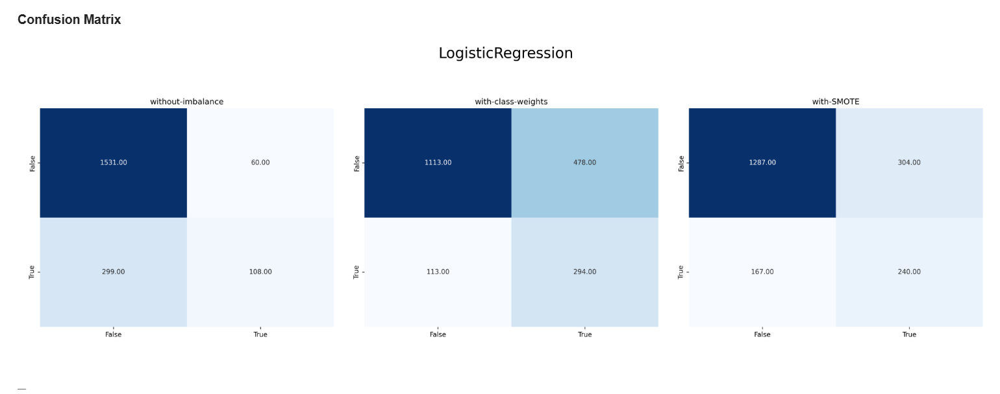
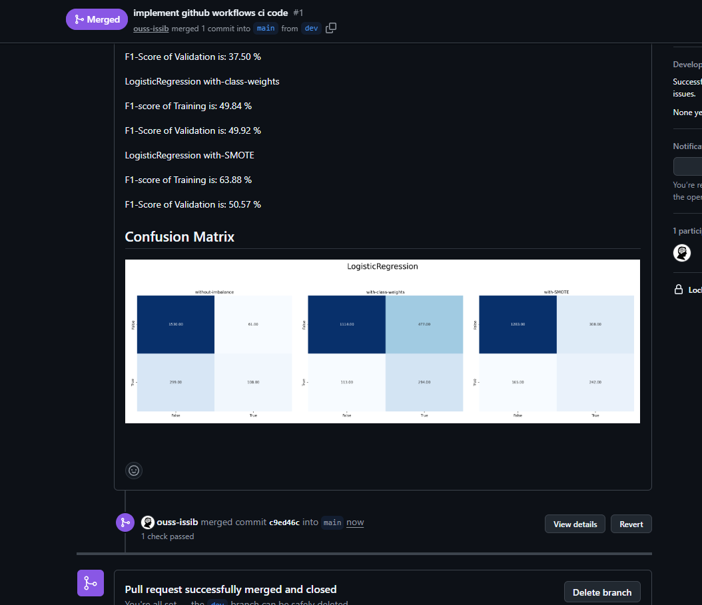
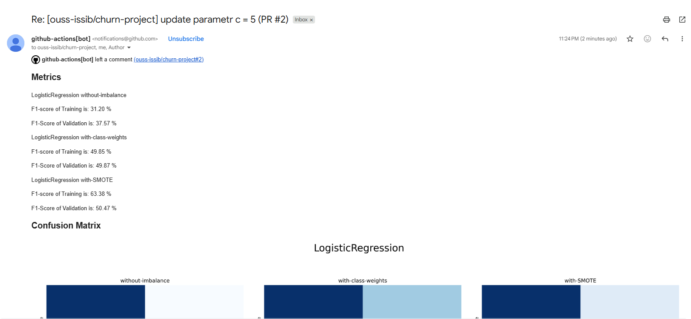

# 🧩 Atelier Pratique – MLOps de bout en bout DVC + S3 + GitHub Actions + CML

[cite_start]Ce dépôt présente une implémentation complète d’une boucle **MLOps** de bout en bout pour la détection du Churn [cite: 775-778].  
Cette activité pratique est réalisée dans le cadre du cours **DevOps & MLOps** encadré par **Pr. [cite_start]Soufiane HAMIDA**[cite: 779].

## 📘 Aperçu du projet

### Pipeline MLOps
- [cite_start]**Objectif** : Construire un système automatisé de gestion du cycle de vie d'un modèle ML (Versionnage, Entraînement, Déploiement) [cite: 781-789].
- **Technologies Utilisées** :
  - [cite_start]Python 3.11 [cite: 803]
  - [cite_start]DVC (Data Version Control) [cite: 807]
  - [cite_start]AWS S3 (Stockage des artefacts) [cite: 782]
  - [cite_start]GitHub Actions (Automatisation CI/CD) [cite: 785]
  - [cite_start]CML (Continuous Machine Learning) [cite: 789]
  - [cite_start]Scikit-Learn & Imbalanced-learn [cite: 805, 806]

---

## 🧱 Structure du projet

[cite_start]├── .dvc/               # Configuration du stockage distant S3 [cite: 944]
[cite_start]├── .github/workflows/  # Pipeline CI/CD (GitHub Actions) [cite: 945]
├── captures/           # Captures d'écran des résultats
[cite_start]├── data/               # Datasets versionnés par DVC [cite: 810]
[cite_start]├── models/             # Modèles entraînés et métriques [cite: 811]
[cite_start]├── script.py           # Script d'entraînement (Logistic Regression) [cite: 809]
[cite_start]└── requirements.txt    # Dépendances du projet [cite: 891]

---

## 📦 Gestion des Artefacts (DVC + S3)

### 📂 Versionnage des Données
DVC permet de tracker les datasets volumineux. [cite_start]Les fichiers réels sont stockés sur AWS S3, tandis que Git ne conserve que les fichiers `.dvc` (pointeurs)[cite: 935, 943].

### ☁️ Remote Storage – AWS S3
[cite_start]Le stockage est centralisé sur un bucket S3 avec une politique d'accès restreinte (IAM) pour garantir la sécurité des modèles[cite: 815, 846].

---

## 🌐 Pipeline CI/CD – GitHub Actions

Le workflow automatisé effectue les tâches suivantes à chaque push :
- [cite_start]**Restauration** : Récupération des données depuis S3 via `dvc pull` [cite: 990-993].
- [cite_start]**Exécution** : Ré-entraînement du modèle avec `script.py` [cite: 997-998].
- [cite_start]**Mise à jour** : Versionnage des nouveaux artefacts et push vers S3 [cite: 1006-1013].
- [cite_start]**Reporting** : Génération d'un rapport de performance via CML [cite: 1014-1023].

---

## 📸 Captures d’écran

### 🧩 MLOps – Aperçu Global & Versionnage
| DVC Push (Local) | Stockage S3 (Objets MD5) |
|---|---|
|  |  |

---

### 🔄 Pipeline GitHub Actions (CI/CD)
| Workflow en cours | Entraînement terminé |
|---|---|
|  |  |

| Test de mise à jour | Succès du Workflow |
|---|---|
|  |  |

---

### 🧑‍🔬 Résultats & Rapports CML
| Rapport Final (Metrics & Plot) | Détail Régression Logistique |
|---|---|
|  |  |

| Commentaire Pull Request | Notification Mail (Succès) |
|---|---|
|  |  |

---


## 🚀 Comment Exécuter le Projet

### 1️⃣ Initialisation Locale
```bash
# Installer les dépendances
pip install -r requirements.txt
pip install "dvc[s3]==3.63.0"

# Initialiser DVC et configurer le remote
dvc init
dvc remote add -d my-s3-remote s3://my-s3-dvc-ouss-issib/dvc-storage
dvc remote modify my-s3-remote region eu-north-1


## `Churn Detection with use of CML & DVC Tools `
    * Using different approaches for solving imbalancing dataset.
    * Using different Algorithms also.
-------------------
### Note
> `cml-churn.yaml` file is attached to this directory. You can put it in `.github/workflows/cml-churn.yaml` as usual.

-----------------------------------------------------------------
## `DVC Installation`
``` bash
pip install dvc
pip install dvc-gdrive  # for using gdrive
```

### Git
``` bash
git init
git add .
git commit -m "initial commit"
git remote add origin <ssh or http link>
git push
git status
```

### DVC
``` bash
dvc init
dvc add data.csv
dvc remote add --default myremote gdrive://<fodler-id> # if using gdrive
dvc push
dvc status
dvc doctor
```


``` bash
# find the default.json file credentials
C:\Users\YourUsername\AppData\Local
```


